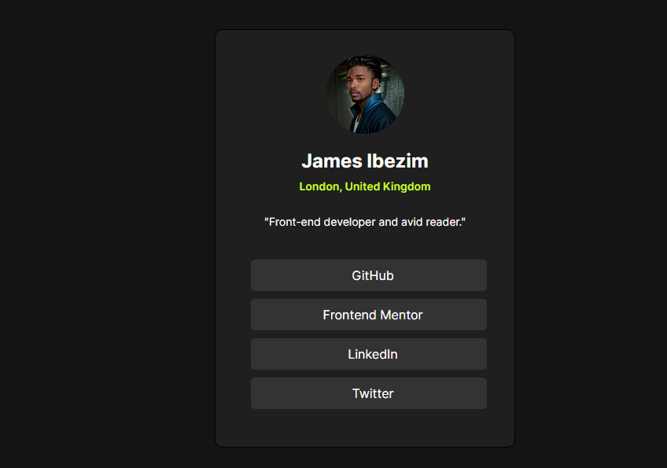

# Frontend Mentor - Social links profile solution

This is a solution to the [Social links profile challenge on Frontend Mentor](https://www.frontendmentor.io/challenges/social-links-profile-UG32l9m6dQ). Frontend Mentor challenges help you improve your coding skills by building realistic projects. 

## Table of contents

- [Frontend Mentor - Social links profile solution](#frontend-mentor---social-links-profile-solution)
  - [Table of contents](#table-of-contents)
  - [Overview](#overview)
    - [The challenge](#the-challenge)
    - [Screenshot](#screenshot)
    - [Links](#links)
  - [My process](#my-process)
    - [Built with](#built-with)
    - [What I learned](#what-i-learned)
    - [Continued development](#continued-development)
  - [Author](#author)

## Overview

### The challenge

Users should be able to:

- See hover and focus states for all interactive elements on the page

### Screenshot

### Links

- Solution URL: [solution URL](https://social-links-profile-rho-gilt.vercel.app/)
- Live Site URL: [live site URL](https://social-links-profile-rho-gilt.vercel.app/)

## My process

### Built with

- Semantic HTML5 markup
- CSS custom properties
- Flexbox
- CSS Grid
- Mobile-first workflow

### What I learned

Learnt about media queries and styling complex css anchor tags

### Continued development

I would like to advance my knowledge on css box-sizing and grid.

## Author

- Website - [James Ibezim](www.linkedin.com/in/james-chiagozie-ibezim)
- Frontend Mentor - [jimztech](https://www.frontendmentor.io/profile/Jimztech)
- Twitter - [engr_jamie](https://x.com/Engr_Jamie)